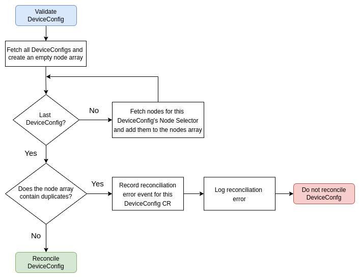

# Hardware Enablement Kubernetes Operator Authoring Guide

This document aims to be a practical guide to writing [Kubernetes Operators](https://kubernetes.io/docs/concepts/extend-kubernetes/operator/),
which manage [out-of-tree kernel modules](https://www.kernel.org/doc/Documentation/kbuild/modules.txt)
and optionally the respective [device plugins](https://kubernetes.io/docs/concepts/extend-kubernetes/compute-storage-net/device-plugins/),
in [Go](https://go.dev/), in order to make specialized hardware available to Kubernetes.

For an in-depth introduction to Kubernetes Operators, the respective [CNCF White Paper](https://github.com/cncf/tag-app-delivery/blob/eece8f7307f2970f46f100f51932db106db46968/operator-wg/whitepaper/Operator-WhitePaper_v1-0.md)
is probably the best source of reading.

- [Prerequisites](#prerequisites)
    - [TL;DR](#tl;dr)
    - [Go](#go)
    - [Operator Frameworks and Libraries](#operator-frameworks-and-libraries)
        - [Helper Libraries](#helper-libraries)
    - [Kernel Module Management Operator](#kernel-module-management-operator)
    - [Sample Kernel Module](#sample-kernel-module)
    - [Sample Device Plugin](#sample-device-plugin)
- [Getting Started](#getting-started)
- [Creating the API](#creating-the-api)
    - [DeviceConfig CRD](#deviceconfig-crd)
        - [DeviceConfigSpec](#deviceconfigspec)
    - [Updating the DeviceConfig CRD](#updating-the-deviceconfig-crd)
- [Validating the NodeSelector](#validating-the-nodeselector)
- [Adding the KMM Module CR](#adding-the-kmm-module-cr)
    - [Understanding the KMM Module CR](#understanding-the-kmm-module-cr)
    - [Extending RBAC](#extending-rbac)
- [Best Practices](#best-practices)
    - [Adding Finalizers](#adding-finalizers)
    - [Using Conditions](#using-conditions)
    - [Recording Events](#recording-events)
    - [Adjusting Logging](#adjusting-logging)
    - [Exposing Metrics](#exposing-metrics)
    - [Updating the Dockerfile](#updating-the-dockerfile)
    - [Configuration](#configuration)
    - [Linting](#linting)
    - [Vendoring](#vendoring)
    - [Writing Unit Tests](#writing-unit-tests)
        - [Mocking](#mocking)
    - [Setting up CI](#setting-up-ci)
- [Coming Up](#coming-up)

## Prerequisites

The following sections outline what we use to build the Go Kubernetes Operator.

### TL;DR

- Go [1.17](https://go.dev/doc/devel/release#go1.17)
- operator-sdk [v1.21.0](https://github.com/operator-framework/operator-sdk/releases/tag/v1.21.0)
- [Kernel Module Management Operator (KMMO)](https://github.com/kubernetes-sigs/kernel-module-management)
- [Hardware Enablement Sample Kubernetes Operator](https://github.com/mresvanis/he-sample-operator)

### Go

We will use [Go 1.17](https://go.dev/doc/devel/release#go1.17), as at the time of this writing this
is the official Red Hat supported [version](https://catalog.redhat.com/software/containers/rhel8/go-toolset/5b9c810add19c70b45cbd666).

### Operator Frameworks and Libraries

Many frameworks exist to develop operators, but in this guide we will be focusing on:

- [Operator SDK](https://github.com/operator-framework/operator-sdk)
- [kubebuilder](https://github.com/kubernetes-sigs/kubebuilder)

`Operator SDK` leverages `kubebuilder` and the latter is developed on top of the
[controller-runtime](https://github.com/kubernetes-sigs/controller-runtime) and the
[controller-tools](https://github.com/kubernetes-sigs/controller-tools) sets of libraries.

This [diagram](https://book.kubebuilder.io/architecture.html) gives you a better idea on how
everything fits together.

We will use the operator-sdk [v1.21.0](https://github.com/operator-framework/operator-sdk/releases/tag/v1.21.0), which supports Go 1.17.

#### Helper Libraries

The following set of libraries can be of help when writing operators and it is a great place to
start with when you feel that certain pieces of your codebase [smell](https://en.wikipedia.org/wiki/Code_smell):

* [controller-runtime](https://github.com/kubernetes-sigs/controller-runtime), e.g. [controllerutil](https://github.com/kubernetes-sigs/controller-runtime/tree/master/pkg/controller/controllerutil)
* [kubernetes/utils](https://github.com/kubernetes/utils), e.g. [pointer](https://pkg.go.dev/k8s.io/utils/pointer)
* [kubernetes/apimachinery/util](https://github.com/kubernetes/apimachinery/blob/master/pkg/util/), e.g. [version](https://github.com/kubernetes/apimachinery/blob/master/pkg/util/version/version.go)

### Kernel Module Management Operator

Enabling specialized hardware on Kubernetes requires loading the respective out-of-tree
[kernel modules](https://linux.die.net/lkmpg/x40.html) on the specified nodes. In addition, [device plugins](https://kubernetes.io/docs/concepts/extend-kubernetes/compute-storage-net/device-plugins/)
can be used if such hardware should be advertised to [Kubelet](https://kubernetes.io/docs/reference/command-line-tools-reference/kubelet/).

We will offload these tasks to the another operator that does exactly that, the
[Kernel Module Management Operator (KMMO)](https://github.com/kubernetes-sigs/kernel-module-management).

### Sample Kernel Module

- https://github.com/mresvanis/he-sample-kernel-module

### Sample Device Plugin

WIP

## Getting Started

Initialize the project with the `operator-sdk` CLI tool and create a new API named `DeviceConfig`.

> For more details about how to get started, check [this](https://sdk.operatorframework.io/docs/building-operators/golang/tutorial/)
> tutorial.

## Creating the API

We can now adjust the `DeviceConfig` [Custom Resource Definition](https://kubernetes.io/docs/tasks/extend-kubernetes/custom-resources/custom-resource-definitions/)
(CRD) to the recommended API for hardware enablement operators.

### DeviceConfig CRD

The `DeviceConfig` specification has the following goals:

- to support multiple `DeviceConfig`s on a cluster, each one targeting a unique group of nodes via a
  [NodeSelector](https://pkg.go.dev/k8s.io/api/core/v1#PodSpec)
- each `DeviceConfig` can have a different kernel module configuration

#### DeviceConfigSpec

| Field | Description | Scheme | Required |
| ----- | ----------- | ------ | -------- |
| DriverImage | The driver image to use | string | true |
| DriverVersion | The driver version to use | string | true |
| NodeSelector | Specifies the node selector to be used for this DeviceConfig | map[string]string |false |

#### DeviceConfigStatus

| Field | Description | Scheme | Required |
| ----- | ----------- | ------ | -------- |
| Conditions | The list of conditions that report the status of the Custom Resource | [][metav1.Condition](https://pkg.go.dev/k8s.io/apimachinery/pkg/apis/meta/v1#Condition) | false |

### Updating the DeviceConfig CRD

We can edit the `api/v1alpha1/deviceconfig_types.go` to reflect the afore-mentioned `DeviceConfigSpec`.
In addition, we add a [Conditions](https://github.com/kubernetes/community/blob/master/contributors/devel/sig-architecture/api-conventions.md#typical-status-properties)
array to the [status subresource](https://kubernetes.io/docs/tasks/extend-kubernetes/custom-resources/custom-resource-definitions/#status-subresource)
of the CRD.

```go
// api/v1alpha1/deviceconfig_types.go

import(
  metav1 "k8s.io/apimachinery/pkg/apis/meta/v1"
)

// DeviceConfigSpec defines the desired state of DeviceConfig
type DeviceConfigSpec struct {
  //+kubebuilder:validation:Required
  // DriverImage is the driver image to use
  DriverImage string `json:"driverImage"`
  //+kubebuilder:validation:Required
  // DriverVersion is the driver version to be deployed
  DriverVersion string `json:"driverVersion"`
  //+kubebuilder:validation:Optional
  // NodeSelector specifies a selector for the DeviceConfig
  NodeSelector map[string]string `json:"nodeSelector,omitempty"`
}

// DeviceConfigStatus defines the observed state of DeviceConfig
type DeviceConfigStatus struct {
  // Conditions is a list of conditions representing the DeviceConfig's current state.
  Conditions []metav1.Condition `json:"conditions"`
}
```

Since we changed the API, let's generate the required runtime.Object interface code and the
manifests like CRs and CRDs.

```shell
make generate
make manifests
```

## Validating the Node Selector

One of the critical steps before performing any reconciliation steps on the requested `DeviceConfig`
CR, is the validation of its `nodeSelector` field. We need to ensure that each selected node is
managed by only one `DeviceConfig` CR.

One way of verifying that the requested `DeviceConfig` CR does not target a node that is already
targeted by another `DeviceConfig` CR, is to fetch all `DeviceConfig` CRs, for each of them apply
their `nodeSelector` and put the node names in an array. When all `DeviceConfig` CRs have been
processed, if the node name array contains any duplicates, then the requested `DeviceConfig` CR
should not be reconciled.



> For more details please check the following sample `DeviceConfig` `nodeSelector` validator
> [code](https://github.com/mresvanis/he-sample-operator/blob/main/internal/nodeselector/nodeselector.go)
> and its respective use in the [reconcile loop](https://github.com/mresvanis/he-sample-operator/blob/main/controllers/deviceconfig_controller.go#L115-L125)
> of the controller.

> If you are wondering about the use of the `internal/` directory, feel free to checkout
[this](https://go.dev/doc/go1.4#internalpackages) and [this](https://docs.google.com/document/d/1e8kOo3r51b2BWtTs_1uADIA5djfXhPT36s6eHVRIvaU/edit)

## Adding the KMM Module CR

The [KMM](https://github.com/kubernetes-sigs/kernel-module-management) operator provides us with the
[API](https://github.com/kubernetes-sigs/kernel-module-management/blob/main/api/v1beta1/)
to seamlessly and robustly deploy our [out-of-tree kernel module](https://www.kernel.org/doc/Documentation/kbuild/modules.txt).
Specifically, we will use the [Module CRD](https://github.com/kubernetes-sigs/kernel-module-management/blob/main/api/v1beta1/module_types.go#L299)
to create a `Module` CR for each `DeviceConfig` CR the controller reconciles.

To that end, the `DeviceConfig` controller uses the [ModuleReconciler](https://github.com/mresvanis/he-sample-operator/blob/main/internal/module/module.go), which
is responsible for ensuring that the desired `Module` CR is applied to the cluster.

### Understanding the KMM Module CRD

The KMMO [Module CRD](https://github.com/kubernetes-sigs/kernel-module-management/blob/main/api/v1beta1/module_types.go#L299)
supports pre-built kernel module container images, as well as in-cluster built container images. We
focus on the former, as we believe that this is the best security strategy.

TODO: elaborate on prebuilt container images

Below is an example of a `Module` CR for a prebuilt kernel module container image:

```go
import (
  kmmv1beta1 "github.com/kubernetes-sigs/kernel-module-management/api/v1beta1"
)

m := &kmmv1beta1.Module{
  ObjectMeta: metav1.ObjectMeta{
    Name:      "my-module-name",
    Namespace: "my-namespace",
  },
  Spec: kmmv1beta1.ModuleSpec{
    ModuleLoader: kmmv1beta1.ModuleLoaderSpec{
      Container: kmmv1beta1.ModuleLoaderContainerSpec{
        ImagePullPolicy: corev1.PullAlways,
        KernelMappings:  []kmmv1beta1.KernelMapping{
          {
            ContainerImage: fmt.Sprintf("%s:%s-${KERNEL_FULL_VERSION}", "driver-image-url", "driver-version-used-as-an-image-tag"),
            Regexp:         `^.*\.el\d_?\d?\..*$`,
          },
        },
      },
      ServiceAccountName: "a-service-account-name",
    },
    Selector: map[string]string{
      "a-node": "label",
    },
  },
}
```

TODO: elaborate on `KerneMappings` and the predefined [environment variables](https://github.com/kubernetes-sigs/kernel-module-management/blob/515e44dc476d44e106d3eab5e96ff1a3cafff4f5/internal/module/kernelmapper.go#L21)

TODO: elaborate on `ServiceAccountName`

### Extending RBAC

The `DeviceConfig` controller needs additional permissions to get, create, update, patch and delete
KMMO Module CRs. We can add those permissions using [kubebuilder markers](https://book.kubebuilder.io/reference/markers/rbac.html):

```go
// controllers/deviceconfig_controller.go

//+kubebuilder:rbac:groups="kmm.sigs.k8s.io",resources=modules,verbs=get;list;watch;create;update;patch;delete
```

> Make sure to run `make manifests` after adding/removing kubebuilder markers.

## Best Practices

Check [this](https://github.com/kubernetes/community/blob/712590c108bd4533b80e8f2753cadaa617d9bdf2/contributors/devel/sig-api-machinery/controllers.md)
doc for a guideline to writing controllers.

### Adding Finalizers

[Finalizers](https://kubernetes.io/docs/concepts/overview/working-with-objects/finalizers/) can help
us control garbage collection of resources. In this case, we would like to delete the `DeviceConfig`
CR only after ensuring that the KMM `Module` CR has been successfully deleted. To that end, we add a
finalizer to the `DeviceConfig` CR and delete it when all owned resources have been successfully
deleted.

> For more details please check [this](https://github.com/mresvanis/he-sample-operator/blob/main/internal/finalizers/finalizers.go)
> helper package and [this](https://kubernetes.io/docs/concepts/overview/working-with-objects/owners-dependents/#ownership-and-finalizers)
> doc.

### Using Conditions

[Conditions](https://github.com/kubernetes/community/blob/master/contributors/devel/sig-architecture/api-conventions.md#typical-status-properties)
are the standard mechanism in Kubernetes for higher-level status reporting from a controller. By
following the Kubernetes SIG architecture API conventions regarding conditions, we use them to
communicate the current status of the `DeviceConfig` CRs to other components or users.

[Here](https://github.com/mresvanis/he-sample-operator/blob/main/internal/conditions/conditions.go)
is an example of a conditions helper component for a Hardware Enablement kubernetes operator.

### Recording Events

[Events](https://pkg.go.dev/k8s.io/api/core/v1#Event) are supplemental to the conditions data, which
users can check to understand the state of their cluster. We can use the `controller-runtime`
[recorder](https://pkg.go.dev/sigs.k8s.io/controller-runtime@v0.13.0/pkg/recorder) package to create
events during the lifetime of the `DeviceConfig` controller.

[Here](https://github.com/mresvanis/he-sample-operator/blob/main/controllers/deviceconfig_controller.go#L143-L148)
is an example of using events to inform users that a successful reconciliation has been completed.

> The main idea to using events, in addition to conditions and logs, is that the user might not have
> access to the controller's logs and conditions should report the current state of a resource, but
> not how this state has been reached.

### Exposing Metrics

[Metrics](https://prometheus.io/docs/introduction/overview/#what-are-metrics) play an important role
in understanding the behaviour of an application and Kubernetes operators are no exception. As
[Prometheus](https://prometheus.io/) is the most commonly used monitoring tool in Kubernetes and the
default monitoring stack of [Red Hat OpenShift](https://docs.openshift.com/container-platform/4.11/monitoring/monitoring-overview.html),
the controller-runtime provides a [global prometheus registry](https://github.com/kubernetes-sigs/controller-runtime/blob/master/pkg/metrics/registry.go)
and includes a [collection of metrics](https://book.kubebuilder.io/reference/metrics-reference.html).

Usually additional metrics are needed and [here](https://github.com/mresvanis/he-sample-operator/blob/main/internal/metrics/metrics.go)
is an example of adding a new metric and the respective [documentation](https://book.kubebuilder.io/reference/metrics.html#publishing-additional-metrics).

### Adjusting Logging

Although the Operator SDK (and the [controller-runtime](https://pkg.go.dev/sigs.k8s.io/controller-runtime#hdr-Logging_and_Metrics))
default to [zap](https://pkg.go.dev/github.com/go-logr/zapr) as their [logr](https://pkg.go.dev/github.com/go-logr/logr)
backend, we can replace it with [klog](https://github.com/kubernetes/klog), the [Kubernetes logging library](https://kubernetes.io/docs/concepts/cluster-administration/system-logs/).

[Here](https://github.com/mresvanis/he-sample-operator/blob/main/main.go#L66-L72) is an example of
you can easily replace `zap` with `klog` in your operator.

> More info on controller-runtime logging and structure logging best practices can be found [here](https://github.com/kubernetes-sigs/controller-runtime/blob/master/TMP-LOGGING.md)
> and [here](https://github.com/kubernetes/enhancements/tree/master/keps/sig-instrumentation/1602-structured-logging).

### Updating the Dockerfile

WIP

### Configuration
+Optional

### Linting

[Linting](https://en.wikipedia.org/wiki/Lint_(software)) helps reduce bugs and code style errors,
thus improving code quality and reability. [Golangci-lint](https://github.com/golangci/golangci-lint)
is one of most commonly used group of linters used in the Go community. It includes an exhaustive
list of [linters](https://golangci-lint.run/usage/linters/), but using the default ones is a great
start.

[Here](https://github.com/mresvanis/he-sample-operator/blob/main/Makefile#L107) is an example of how
it could be integrated in your [Makefile](https://www.gnu.org/software/make/manual/make.html).

### Vendoring

Consider [vendoring](https://go.dev/ref/mod#go-mod-vendor) the dependencies of the project, i.e.
making a copy of the third-party packages you are using. This way everyone can deterministically
build the project, without fetching any dependencies from external repositories.

### Writing Unit Tests

Unit tests are an integral part of any software project. We use [Ginkgo](https://github.com/onsi/ginkgo), [Gomega](https://github.com/onsi/gomega) and [gomock](https://github.com/golang/mock) to
write all the unit tests.

> For more details, please check the `DeviceConfig` controller unit tests [here](https://github.com/mresvanis/he-sample-operator/blob/main/controllers/deviceconfig_controller_test.go).

> Kubernetes itself uses `Ginkgo` and `Gomega` for its [end-to-end testing](https://github.com/kubernetes/community/blob/master/contributors/devel/sig-testing/e2e-tests.md).

#### Mocking

One of the most important aspects of testing the `DeviceConfig` controller is to be able to mock the
[controller-runtime client](https://pkg.go.dev/sigs.k8s.io/controller-runtime/pkg/client), in order
to test all the possible workflow paths. We use `gomock`'s [mockgen](https://github.com/golang/mock#running-mockgen)
to generate the [controller-runtime client mock](https://github.com/mresvanis/he-sample-operator/blob/main/internal/client/client.go#L6).

The rest of the `internal/` packages are also mocked in the very [same way](https://github.com/mresvanis/he-sample-operator/blob/main/internal/module/module.go#L41).

> For more details on Go generate, check the respective [documentation](https://pkg.go.dev/cmd/go#hdr-Generate_Go_files_by_processing_source).

### Setting up CI

[Continuous Integration](https://en.wikipedia.org/wiki/Continuous_integration) (CI) ensures the
quality and performance of the software been developed. Whatever CI tools are selected ([Github
Actions](https://docs.github.com/en/actions), [Gitlab CI](https://docs.gitlab.com/ee/ci/),
[Jenkins](https://www.jenkins.io/), [Circle CI](https://circleci.com/) and many others), the
following CI steps would enhance the development experience, robustness and reliability of the code
base:

- linting
- unit testing
- end-to-end tests
- integration tests, for example running a test suite for different Kubernetes and OpenShift
  versions

You can enable triggers for these CI steps for different events, on every {Merge,Pull} Request push,
on every push to the default branch and on every push to `release-*` branches.

> [Here](https://github.com/mresvanis/he-sample-operator/tree/main/.github/workflows) are example
> Github Actions workflows of the sample Hardware Enablement operator.

## Coming Up

The [Container Device Interface](https://github.com/container-orchestrated-devices/container-device-interface)
specification is an enhancement that will simplify and deprecated a lot of duplicate work in the
current [Device Plugins](https://kubernetes.io/docs/concepts/extend-kubernetes/compute-storage-net/device-plugins/).
